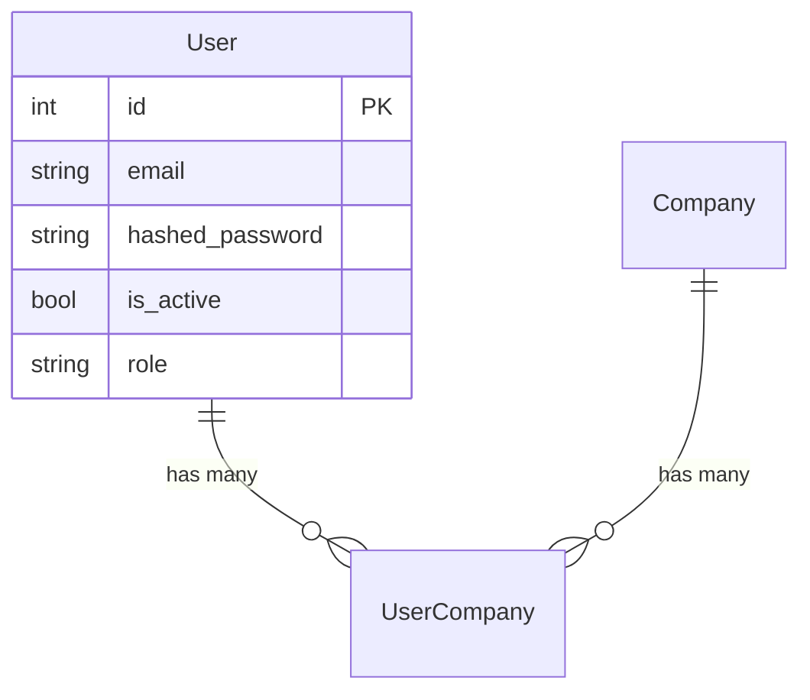

# Model Relationships

> Diagram relacji między encjami. Aktualizuj po każdym dodaniu/zmianie modelu.

## ER Diagram

```mermaid
erDiagram
    User ||--o{ UserCompany : "has many"
    Company ||--o{ UserCompany : "has many"

    User {
        int id PK
        string email
        string hashed_password
        bool is_active
        string role
    }
```

[TODO: Dodaj encje po zdefiniowaniu domain layer]
