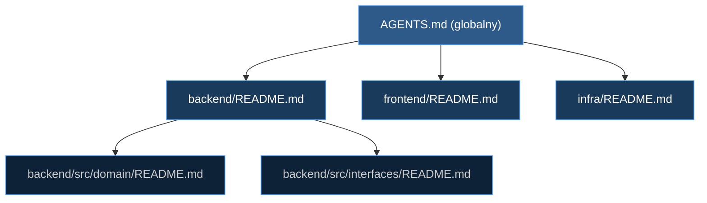

<div align="center">

<picture>
  <source media="(prefers-color-scheme: dark)" srcset="docs/assets/header-dark.svg">
  <source media="(prefers-color-scheme: light)" srcset="docs/assets/header-light.svg">
  
</picture>

**Gotowy szkielet workspace dla zespołów pracujących z wieloma agentami AI**

[](LICENSE)
[](#)
[](#)

<p>


</p>

<p><sub>7 ról · 13 skilli · 7 workflowów · Quality Gate z VETO</sub></p>

</div>

<br>

<table>
<tr>
<td width="33%" valign="top">

### 🏗️ Architektura
Hexagonal Architecture z wydzielonymi warstwami. Role z ograniczeniami plików. Każdy agent wie co może i czego nie może dotykać.

</td>
<td width="33%" valign="top">

### 🔄 Przepływ pracy
Plan -> Review -> Implementacja. Dokumenty Techniczne z pełnym cyklem życia. Analyst -> Architect -> Engineer -> Quality Gate.

</td>
<td width="33%" valign="top">

### 🛡️ Quality Gate
Scoring w 6 kategoriach. VETO przy < 90%. Automatyczne raporty audytu. Bezkompromisowość jako standard.

</td>
</tr>
</table>

---

<p align="center">
  🇵🇱 <strong>Wersja polska</strong>&nbsp;&nbsp;·&nbsp;&nbsp;🇬🇧 <a href="https://github.com/systemowiec/ai-agents-workspace-starter"><em>Wersja angielska</em></a>
</p>

## Dlaczego wersja polska?


Wszystkie instrukcje agentów, role, workflowy i dokumentacja są napisane
w języku polskim z pełną diakrytyką.
To jest świadoma decyzja architektoniczna, nie tłumaczenie wersji angielskiej.
Równoległa wersja angielska jest utrzymywana jako osobne repozytorium i synchronizowana z tym repo po każdej zmianie merytorycznej.

Polska morfologia (aspekt czasownika, przypadki, rodzaj gramatyczny)
koduje informacje, których angielski nie posiada. W praktyce agenci AI
realizujący instrukcje po polsku są mierzalnie dokładniejsi - rzadziej
interpretują ograniczenia swobodnie i ściślej trzymają się procedur.

## Czym jest AI Agents Workspace Starter?

AI Agents Workspace Starter to gotowy szkielet projektu dla deweloperów, którzy chcą
pracować z wieloma agentami AI równolegle - Claude Code, Antigravity, Cursor i Codex CLI -
w jednym, spójnym, dobrze zorganizowanym repozytorium.

Zamiast budować konfiguracje dla każdego narzędzia od zera, dostajesz:

- **Gotowe katalogi konfiguracyjne** dla każdego agenta z punktami wejścia
- **Hierarchie instrukcji**: globalny AGENTS.md -> katalog -> plik
- **Szablony dokumentacji technicznej** gotowe do użycia przez agentów
- **7 wyspecjalizowanych ról** z zakresem odpowiedzialności i ograniczeniami
- **13 skilli wielokrotnego użytku** w formacie Anthropic SKILL.md
- **7 workflowów** pokrywających cały cykl życia zadania
- **Quality Gate** ze scoringiem w 6 kategoriach i mechanizmem VETO

## Dlaczego warto go używać?

- **Zero konfiguracji agentów od zera** - pierwszy agent zaczyna pracę w < 5 minut
- **Jeden workspace, cztery narzędzia** - Claude Code, Antigravity, Cursor i Codex CLI
  czytają z tych samych plików źródłowych, każdy przez swój własny punkt wejścia
- **Hierarchia kontekstu** - agent w katalogu `backend/` automatycznie dostaje kontekst
  globalny + kontekst backendowy, bez ręcznego kopiowania instrukcji
- **Dokumentacja jako kontrakt** - szablony w `docs/szablony/` wymuszają sposób w jaki
  agent raportuje, dokumentuje decyzje i prowadzi audit trail
- **Role z ograniczeniami** - każdy agent wie co MOŻE i czego NIE MOŻE dotykać
- **Folder-based Skills** - format Anthropic, łatwe do rozszerzania i współdzielenia
- **Quality Gate** - audytor z VETO blokującym merge przy niskiej jakości

## Szybki start

```bash
# 1. Sklonuj repozytorium
git clone https://github.com/systemowiec/ai-agents-workspace-starter-pl.git mój-projekt
cd mój-projekt

# 2. Usuń historię git i zacznij od nowa
rm -rf .git
git init

# 3. Otwórz projekt w preferowanym narzędziu
cursor .          # Cursor
code .            # VS Code + Claude / Antigravity
```

Po uruchomieniu przeczytaj `AGENTS.md` w katalogu głównym - to jest punkt startowy
dla każdego agenta i dla Ciebie jako dewelopera.

### Bootstrap projektu

Uruchom workflow inicjalizacji:

```
/project-init
```

Lub ręcznie:

1. Zamień `[PROJECT_NAME]` w `CLAUDE.md`
2. Wypełnij `.agents/context/project-overview.md` danymi projektu
3. Dostosuj role w `.agents/roles/` do swojego stacku
4. Stwórz pierwszy Dokument Techniczny (DT)
5. Skonfiguruj infrastrukturę Docker w `infra/`

## Struktura projektu

```
ai-agents-workspace-starter/
├── .agents/                    # Konfiguracja agentów (Single Source of Truth)
│   ├── context/                # Kontekst projektu (stack, API map, modele)
│   ├── learnings/              # Odkryte gotchas i wzorce
│   ├── roles/                  # 7 definicji ról
│   ├── rules/                  # Reguły globalne + Git workflow
│   ├── skills/                 # 13 skilli (folder-based, format Anthropic)
│   └── workflows/              # 7 workflowów + 7 przełączników ról
│
├── .claude/                    # Konfiguracja Claude Code
│   ├── agents/                 # 7 sub-agentów (thin wrappery do ról)
│   ├── commands/               # 3 slash commands (implement, audit, review)
│   └── settings.json           # Uprawnienia (Docker-first enforcement)
│
├── .cursor/rules/              # 9 reguł Cursor (.mdc z globami)
├── .codex/config.toml          # Konfiguracja Codex CLI
│
├── backend/                    # Punkt startowy backendu
├── frontend/                   # Punkt startowy frontendu
├── infra/                      # Punkt startowy infrastruktury
│
├── docs/                       # Dokumentacja
│   ├── agent-reports/          # Raporty między agentami
│   ├── cheatsheets/            # Cheat sheety (Claude Code, Antigravity, Cursor, Codex)
│   ├── dt/                     # Dokumenty Techniczne (auto-numeracja)
│   └── szablony/               # Szablony (DT, raport, audyt)
│
├── AGENTS.md                   # Globalny punkt wejścia - czytaj jako pierwszy
└── CLAUDE.md                   # Entry point Claude Code
```

## Jak to działa - hierarchia kontekstu agenta

Każdy agent otrzymuje kontekst w kolejności od ogólnego do szczegółowego:



Agent pracujący w `backend/src/` automatycznie wie:
- jaka jest globalna architektura projektu (z AGENTS.md)
- jaka jest architektura backendu (z backend/README.md)
- jakie są zasady dla tego konkretnego modułu (z lokalnego README.md)

Nie musisz powtarzać kontekstu w każdym prompcie.

## Punkty wejścia dla poszczególnych narzędzi

| Narzędzie | Konfiguracja | Punkt wejścia |
|---|---|---|
| **Claude Code** | `.claude/` | `CLAUDE.md` (root) |
| **Antigravity** | `.agents/` | `AGENTS.md` (root) |
| **Cursor** | `.cursor/rules/` | `.cursor/rules/global.mdc` |
| **Codex CLI** | `.codex/config.toml` | `AGENTS.md` (root) |
| **Każde inne** | - | `AGENTS.md` (root) |

## Role agentów

| Rola | Zakres | Konfiguracja |
|------|--------|-------------|
| **Analyst** | Zbieranie wymagań, tworzenie draft DT | `.agents/roles/analyst.md` |
| **Architect** | Dokumentacja, diagramy, Dokumenty Techniczne, design | `.agents/roles/architect.md` |
| **Backend Engineer** | Backend API, logika domenowa, repozytoria, testy | `.agents/roles/backend-engineer.md` |
| **Frontend Engineer** | Komponenty React/TS, strony, integracja API | `.agents/roles/frontend-engineer.md` |
| **Platform Engineer** | Docker, CI/CD, infrastruktura, Makefile | `.agents/roles/platform-engineer.md` |
| **E2E Engineer** | Testy end-to-end Playwright, POM, Docker | `.agents/roles/e2e-engineer.md` |
| **Quality Gate** | Audyt kodu, scoring w 6 kategoriach, VETO < 90% | `.agents/roles/quality-gate.md` |

### Przełączanie między rolami

```
/as-analyst              # Aktywuj Analityka
/as-backend-engineer     # Aktywuj Backend Engineera
/as-frontend-engineer    # Aktywuj Frontend Engineera
/as-architect            # Aktywuj Architekta
/as-platform-engineer    # Aktywuj Platform Engineera
/as-quality-gate         # Aktywuj Quality Gate (zawsze w osobnej sesji)
/as-e2e-engineer         # Aktywuj E2E Test Engineera
```

---

## Skille

Skille stosują [format Anthropic SKILL.md](https://github.com/anthropics/skills) (folder-based z YAML frontmatter):

| Skill | Kiedy używać |
|:------|:------------|
| `add-endpoint` | Dodawanie nowego REST API endpointu |
| `add-frontend-page` | Dodawanie nowej strony w React |
| `backend-patterns` | Implementacja kodu backendu (FastAPI, repos, serwisy) |
| `database-migration` | Tworzenie lub uruchamianie migracji bazy danych |
| `database-patterns` | Praca z modelami, repozytoriami, migracjami |
| `frontend-patterns` | Implementacja kodu frontendu (React, TS, hooks) |
| `infra-patterns` | Konfiguracja Docker, CI/CD, serwerów |
| `storage-patterns` | Praca z uploadami plików, storage, dokumentami |
| `write-python-tests` | Pisanie lub aktualizacja testów Python |
| `write-e2e-tests` | Pisanie testów E2E w Playwright (POM, fixtures) |
| `brainstorming` | Początek pracy kreatywnej - design before code |
| `self-improvement` | Uczenie się agenta po sesji pracy |
| `project-bootstrap` | Pierwsza konfiguracja projektu |

```bash
# Tworzenie własnego skilla
cp -r .agents/skills/_template .agents/skills/mój-nowy-skill
```

---

## Workflowy

| Workflow | Komenda | Cel |
|:---------|:--------|:----|
| DT Development | `/dt-development` | Pełna implementacja Dokumentu Technicznego |
| Create DT | `/create-dt` | Nowy Dokument Techniczny z auto-numeracją |
| Complete DT | `/complete-dt` | Zamknięcie DT po implementacji |
| DT Report | `/dt-report` | Tworzenie raportów implementacji |
| Code Review | `/code-review` | Przegląd kodu |
| Post-Impl Verify | `/post-impl-verify` | Obowiązkowa weryfikacja po zmianach |
| Project Init | `/project-init` | Inicjalizacja nowego projektu |

## 4 Kardynalne Zasady

1. **Quality-First** - najlepsze możliwe rozwiązanie. Zawsze. Zero shortcutów.
2. **Documentation First** - zaktualizuj dokumentację PRZED pisaniem kodu.
3. **Docker First** - nigdy nie uruchamiaj Python/npm/pip lokalnie. Zawsze Docker/Make.
4. **Plan -> Review -> Implementation** - zawsze w tej kolejności. Czekaj na akceptację.

### Przepływ pracy agenta

```
ANALIZA -> PLAN -> CZEKANIE NA AKCEPTACJĘ -> DOKUMENTACJA -> IMPLEMENTACJA -> WERYFIKACJA -> RAPORT
```

### Quality Gate - punktacja

| Kategoria | Waga |
|-----------|------|
| Architektura | 25% |
| Bezpieczeństwo | 20% |
| Testy | 20% |
| Jakość kodu | 15% |
| Kontrakty API | 10% |
| Dokumentacja | 10% |

**VETO przy < 90%** - blokuje merge aż do rozwiązania problemów.

---

## Stack technologiczny

Ten starter domyślnie zakłada stack:

| Warstwa | Technologia |
|---|---|
| Backend | Python 3.12+ / FastAPI |
| Frontend | React 18+ / TypeScript / Vite |
| Baza danych | PostgreSQL (lub inna) |
| Cache | Redis |
| Konteneryzacja | Docker + Docker Compose |

> **To jest starter, nie gotowa aplikacja.** Stack możesz zmienić na dowolny -
> dostosuj role w `.agents/roles/` i kontekst w `.agents/context/` do swojego projektu.

---

## Dostosowywanie

### Usuń to, czego nie potrzebujesz

| Jeśli nie używasz... | Usuń |
|---------------------|------|
| Claude Code | `.claude/`, `CLAUDE.md` |
| Cursor | `.cursor/` |
| Codex CLI | `.codex/` |
| Frontendu | `.agents/roles/frontend-engineer.md`, `.agents/skills/frontend-patterns/`, `frontend/` |
| Python backendu | `.agents/roles/backend-engineer.md`, `.agents/skills/backend-patterns/`, `backend/` |

### Dodaj własne

| Co | Gdzie | Jak |
|---|-------|-----|
| Nowa rola | `.agents/roles/moja-rola.md` | Wzoruj się na istniejących |
| Nowy skill | `.agents/skills/mój-skill/SKILL.md` | Skopiuj z `_template/` |
| Nowy workflow | `.agents/workflows/mój-workflow.md` | YAML frontmatter + kroki |
| Cursor rule | `.cursor/rules/moja-reguła.mdc` | Użyj `globs:` do aktywacji |
| Claude command | `.claude/commands/moja-cmd.md` | YAML frontmatter + instrukcje |
| Claude agent | `.claude/agents/mój-agent.md` | Thin wrapper do pliku roli |

---

## Szablony dokumentacji

W katalogu `docs/szablony/` znajdują się szablony, które agent wypełnia automatycznie:

- **`_dt.md`** - Dokument Techniczny opisujący decyzje implementacyjne
- **`_dt-raport.md`** - Raport implementacji po zakończeniu prac
- **`_audit-raport.md`** - Raport audytu Quality Gate ze scoringiem

Agenci są skonfigurowani tak, aby używać tych szablonów zawsze gdy tworzą dokumentację.

---

## Contributing

Chcesz rozwijać ten projekt? Przeczytaj [CONTRIBUTING.md](CONTRIBUTING.md).

---

## Licencja

MIT - szerzej w pliku [LICENSE](LICENSE).

---

<div align="center">

**Stworzone przez [systemowiec](https://github.com/systemowiec)**

</div>
